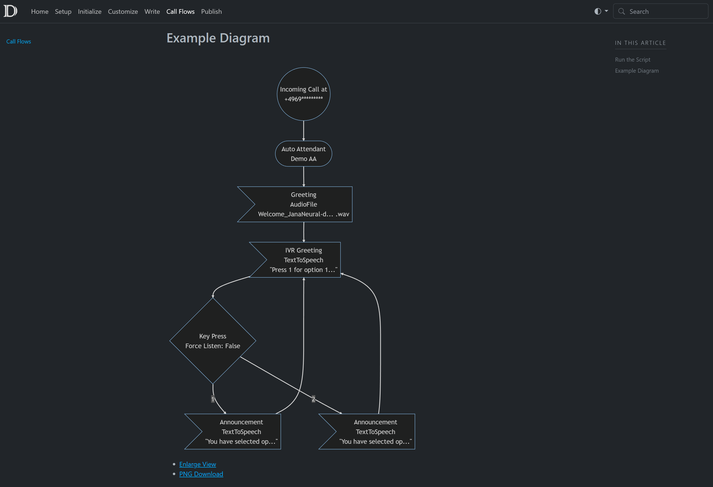

## Profile

I work as a Senior Microsoft 365 Engineer for a global enterprise. In February 2023 I was awarded Microsoft MVP in M365 Apps & Services. My main focus areas are Microsoft Teams Telephony and PowerShell. I also have experience with Azure (Virtual Machines, Load Balancers, Traffic Manager, Azure Functions, Automation Accounts etc.) and also like to tinker with Power Automate Flows.

  

## Community Controbutions

### M365 Call Flow Visualizer

I am the creator and inventor of the M365 Call Flow Visualizer. The Microsoft 365 Call Flow Visualizer is a PowerShell tool which I developed for the Teams community. This tool can automatically render flowchart diagrams of your Teams call flows. This is great for documenting and troubleshooting calls flows.

#### [GitHub Repo](https://github.com/mozziemozz/M365CallFlowVisualizer)

### Awesome DocFx Template

Awesome DocFx Template is a GitHub repo and a docs website which help you get started with DocFx quickly. Instead of creating your structure manually you can generate all required folders and files with a PowerShell script.

#### Highlights

**Jump start your DocFx website**: The docs site includes all the information and setup instructions you need to get started with DocFx quickly. There's no need to research everything yourself.

**Host on SharePoint Online**: The repo includes a script which tweaks the generated site so that it can be hosted on SharePoint Online. The script will automatically upload any updated files on SharePoint.

**M365 Call Flow Visualizer Support**: The repo also includes a script to extract and include all configured Teams call flows on your markdown based docs website. Even audio files or TTS greetings are supported. Diagrams can be downloaded as PNGs.

#### [GitHub Repo](https://github.com/mozziemozz/awesome-docfx-template)
#### [Docs](https://delightful-bush-073e2f403.3.azurestaticapps.net)

